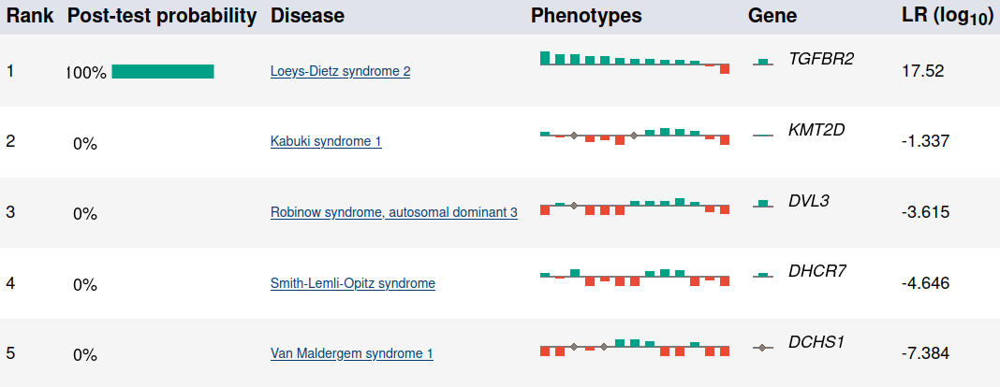

# LIRICAL

LIRICAL (LIkelihood Ratio Interpretation of Clinical AbnormaLities) 
is designed to provide clinically interpretable computational analysis of phenotypic
abnormalities (encoded using the [Human Phenotype Ontology](http://www.human-phenotype-ontology.org)),
optionally combined with an analysis of variants and genotypes if a VCF file is provided with the
results of diagnostic gene panel, exome, or genome sequencing.

The prioritized diseases are reported in human-friendly HTML report. 
The report summarizes the most likely differential diagnoses:

and breaks down the contributions of the HPO terms and deleterious variants in the associated genes for each diagnosis:

The report is also available in JSON/TSV formats suitable for programmatic post-processing.

## Availability

Most users should download the latest distribution ZIP file from the [Releases page](https://github.com/TheJacksonLaboratory/LIRICAL/releases).

## Learn more

Read more about the LIRICAL *algorithm* 
in the manuscript available at the [American Journal of Human Genetics](https://pubmed.ncbi.nlm.nih.gov/32755546/).

Consult the documentation for *installation instructions* and a *tutorial*:
- [Stable documentation](https://thejacksonlaboratory.github.io/LIRICAL/stable)
- [Edge release documentation](https://thejacksonlaboratory.github.io/LIRICAL/latest)

Developers can access *API reference* at:
- [Stable](https://thejacksonlaboratory.github.io/LIRICAL/stable/apidocs)
- [Edge release](https://thejacksonlaboratory.github.io/LIRICAL/latest/apidocs)
