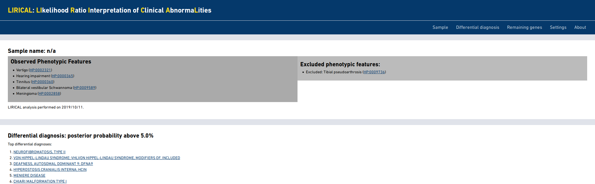
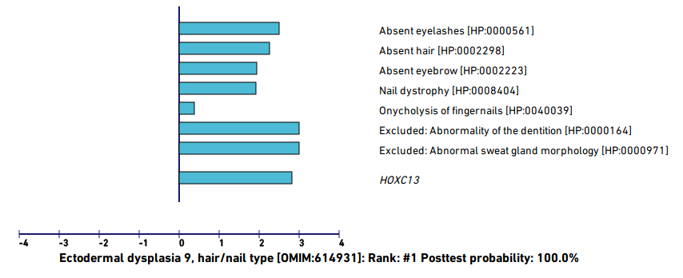

.. _rstlirical-html:

LIRICAL HTML Output
===================

Sample information and list of differentials
~~~~~~~~~~~~~~~~~~~~~~~~~~~~~~~~~~~~~~~~~~~~

The HTML output page begins with a summary of the sample name and a list of
the `HPO <http:\\www.human-phenotype-ontology.org>`_ terms
used to run the program. By default, LIRICAL shows a detailed output only for the top 10 differential
diagnoses (or more if more diagnoses have a posterior probability above the default threshold of 1%).
The minimum number of differential diagnoses to show can be changed with the ``-m`` option, and
the probability threshold can be changed with the ``-t`` option.

Disease evaluations
~~~~~~~~~~~~~~~~~~~

LIRICAL evaluates each of the diseases in the HPO database and estimates the probability that a disease
explains the observed phenotypic abnormalities (and if applicable, the observed variants).

For example, the following figure shows the evaluation of a simulated case based on a published case
report of an individual with pure hair and nail ectodermal dysplasia (ECTD9) related to a pathogenic variant
in the *HOXC13* gene
(`Khan et al., 2017 <https://www.ncbi.nlm.nih.gov/pubmed/28403827>`_).

LIRICAL has estimate the composite likelihood ratio score at 8.951 (note that this is expressed
on a log\ :subscript:`10` scale, so that the likelihood ratio is actually 10\ :superscript:`8.951`). The
posttest probability is close to 100%.

The contribution of each of the HPO terms entered for the proband is shown. In this case,
`Nail dystrophy <https://hpo.jax.org/app/browse/term/HP:0008404>`_ makes the largest contribution, and a number
of other features make more modest contributions (as indicated by the length of the blue bar).

The user should inspect the top differentials. In this case, the posterior probability of the remaining differentials
drops off quickly. For instance, the third best hit, Nicolaides Baraitser syndrome, has a posttest probability of
only 3.6% and several of the observed phenotypes are not characteristic of this syndrome and thus reduce the match score
(indicated as red bars).

.. figure:: _static/nb-diff.png

