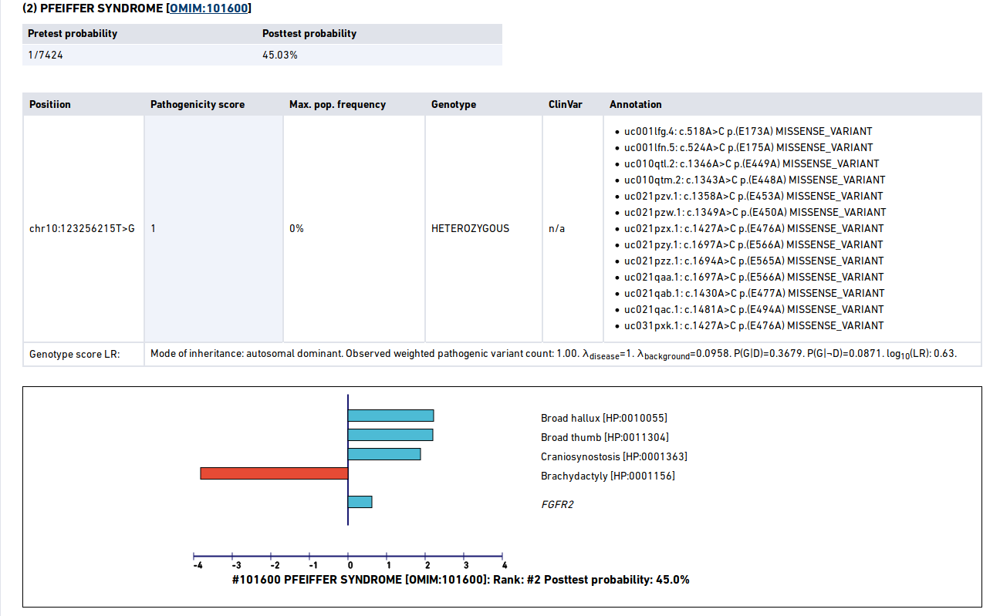

LR2PG Output
============

Use either the :ref:`yaml` or the :ref:`phenopacket` method to run LR2PG. By default, LR2PG will output an HTML file
that contains a summary of its analysis results. LR2PG can also output a TSV file that can be used by bioinformatic
pipelines. Depending on you computer, LR2PG will run from about 15 to 60 seconds, or longer if a whole-genome file is used
as input.

The HTML Output
~~~~~~~~~~~~~~~

The HTML output page begins with a summary of the sample name and a list of the `HPO <http:\\www.human-phenotype-ontology.org>`_ terms
used to run the program. By default, LR2PG shows a detailed output only for diseases whose posttest probability is
calculated to be more than a threshold whose default value is 1% (but which can be adjusted using the ``-t`` command line
argument). For example, the following figures show an example in which Pfeiffer syndrome was ranked as the second
candidate according to its posttest probability of 45%. One heterozygous variant in the *FGFR2* gene was identified whose predicted
pathogenicity score was 1.0. This corresponds to a genotype likelihood ratio score of 10^{0.63} for this gene.
The diagnram then shows the contribution of each of the HPO terms as well as the genotype to the combined likelihood
ratio for this diagnosis. In this case, Broad hallux, Broad thumb, and Craniosynostosis have a contribution of
100-fold or more (note that the X-axis shows the base-10 logarithm of the likelihood ratios). Brachydactyly shows
a negative contribution because it is not associated with the disease (its likelhood ratio is shown in red).

The TSV Output
~~~~~~~~~~~~~~
If LR2PG is run with the ``-tsv`` option, it will output a tab-separated values (TSV) file with the results for each of the
diagnoses.

TODO-- we still have not finalized the format, but this is what it looks like now. A total of 7424 diagnoses were tested,
whose posttest probability ranged from 45.03% to 0.00% ::

    ! LR2PG TSV Output
    ! Sample: manuel
    ! Observed HPO terms
    ! Brachydactyly (<a href="https://hpo.jax.org/app/browse/term/HP:0001156">HP:0001156</a>)
    ! Craniosynostosis (<a href="https://hpo.jax.org/app/browse/term/HP:0001363">HP:0001363</a>)
    ! Broad thumb (<a href="https://hpo.jax.org/app/browse/term/HP:0011304">HP:0011304</a>)
    ! Broad hallux (<a href="https://hpo.jax.org/app/browse/term/HP:0010055">HP:0010055</a>)
    rank	diseaseName	diseaseCurie	pretestprob	posttestprob	compositeLR	entrezGeneId	variants
    1	APERT SYNDROME	OMIM:101200	1/7424	45.03%	6,080.832	NCBIGene:2263	chr10:123256215T>G uc001lfg.4:c.518A>C:p.(E173A) pathogenicity:1.0 [HETEROZYGOUS]
    2	PFEIFFER SYNDROME	OMIM:101600	1/7424	45.03%	6,080.832	NCBIGene:2263	chr10:123256215T>G uc001lfg.4:c.518A>C:p.(E173A) pathogenicity:1.0 [HETEROZYGOUS]
    3	ACROCEPHALOPOLYSYNDACTYLY TYPE III	OMIM:101120	1/7424	4.39%	340.497	n/a
    (...)
    7,422	DEAFNESS, AUTOSOMAL DOMINANT 50	OMIM:613074	1/7424	0.00%	0	NCBIGene:407053
    7,423	EDICT SYNDROME	OMIM:614303	1/7424	0.00%	0	NCBIGene:406960
    7,424	PULMONARY FIBROSIS AND/OR BONE MARROW FAILURE, TELOMERE-RELATED, 2; PFBMFT2	OMIM:614743	1/7424	0.00%	0	NCBIGene:7012

