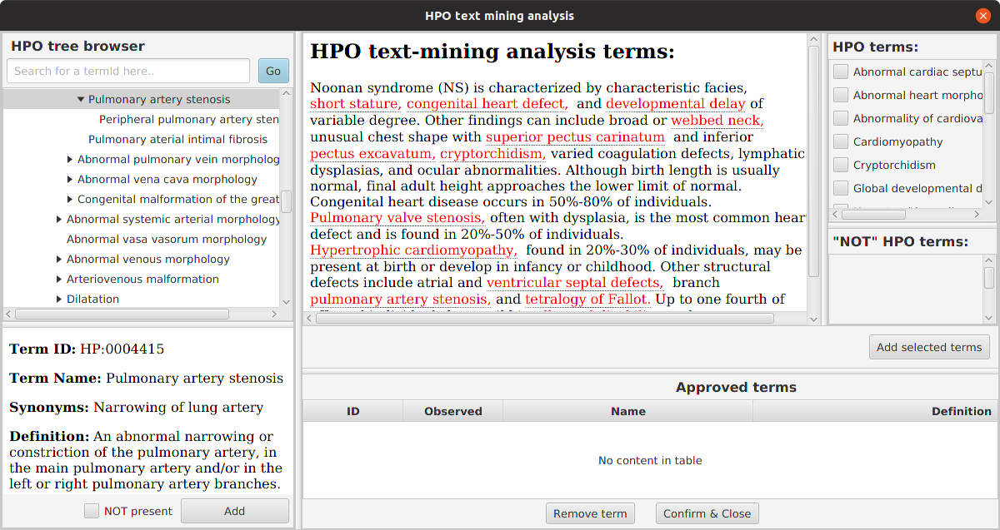

.. _rstrunning:

===============
Running LIRICAL
===============

LIRICAL is a command-line Java tool that runs with Java version 8 or higher. LIRICAL
can be run both with and without genomic data in form of a VCF file from genome, exome,
or NGS gene-panel sequencing.

To get help, run LIRICAL with a command or with the option "-h": ::

    $ java -jar target/LIRICAL.jar -h
      Usage: java -jar LIRICAL [-hV] [COMMAND]
      LIkelihood Ratio Interpretation of Clinical AbnormaLities
        -h, --help      Show this help message and exit.
        -V, --version   Print version information and exit.
      Commands:
        download, D     Download files for LIRICAL
        phenopacket, P  Run LIRICAL from a Phenopacket
        yaml, Y         Run LIRICAL from YAML file

Run LIRICAL with a specific command with the "-h" option to get information about the command, e.g., ::

    $ java -jar target/LIRICAL.jar download -h
      Usage: java -jar LIRICAL download [-hVw] [-d=<datadir>]
      Download files for LIRICAL
        -d, --data=<datadir>   directory to download data (default: data)
        -h, --help             Show this help message and exit.
        -V, --version          Print version information and exit.
        -w, --overwrite        overwrite previously downloaded files (default: false)

LIRICAL has three main commands, ``download``, ``phenopacket``, and ``yaml``. The download command
needs to be run before anything else and downloads some files required for LIRICAL analysis. LIRICAL
can then be run using a Phenopacket or a YAML-formated file as input.

Running LIRICAL with a Phenopacket
~~~~~~~~~~~~~~~~~~~~~~~~~~~~~~~~~~

LIRICAL can be run with clinical data (HPO terms) only or with clinical data and a VCF file representing the
results of gene panel, exome, or genome sequencing. The prefered input format is
`Phenopackets <https://github.com/phenopackets>`_, an open standard for sharing disease and phenotype information.
This is a new standard of the `Global Alliance for Genomics and Health <https://www.ga4gh.org/>`_ that
links detailed phenotype descriptions with disease, patient, and genetic information.

    For convenience, we provide a tool called `PhenopacketGenerator <https://github.com/TheJacksonLaboratory/PhenopacketGenerator>`_ that can be used to create a Phenopacket with a list of HPO terms and the path to a VCF file with which LIRICAL can be run.

.. toctree::
    :maxdepth: 1

    Running LIRICAL with a Phenopacket (only HPO data) <phenopacket-hpo>
    Running LIRICAL with a Phenopacket (VCF and HPO data) <phenopacket-vcf>

Running LIRICAL with a YAML file
~~~~~~~~~~~~~~~~~~~~~~~~~~~~~~~~

The other allowed input format is YAML. The format is designed to be as close as possible to
that of the Exomiser YAML format, but some fields, such as negated HPO terms, as LIRICAL-specific.

.. toctree::
    :maxdepth: 1

    Running LIRICAL with a YAML file <yaml>

Choosing between YAML and Phenopacket input formats
~~~~~~~~~~~~~~~~~~~~~~~~~~~~~~~~~~~~~~~~~~~~~~~~~~~

How should users choose between YAML and Phenopackets as an input format?

.. toctree::
    :maxdepth: 1

    yaml-or-phenopacket