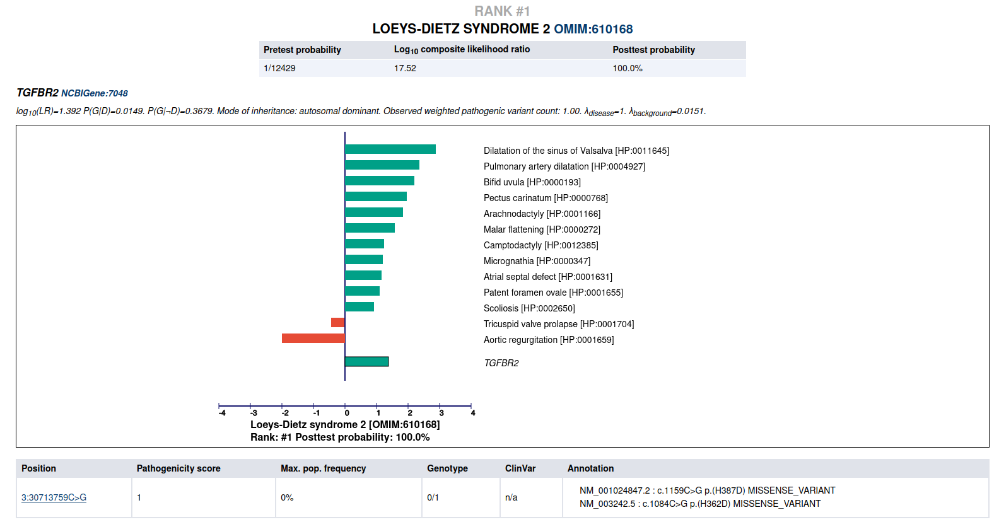

.. _rsttutorial:

Tutorial
========

This tutorial shows how to use LIRICAL to evaluate an exome.

Setup
~~~~~
Follow the instructions in :ref:`rstsetup` to install the Exomiser database.
Note the location of the Exomiser database (it will be needed to run LIRICAL, see below).
Most users should download the pre-built version of LIRICAL available on the `Releases <https://github.com/TheJacksonLaboratory/LIRICAL/releases>`_ page.
Instructions are also offered for building LIRICAL from source if desired.

The data
~~~~~~~~

We have simulated an exome VCF file by adding a disease associated variant to
a VCF file derived from project.NIST.hc.snps.indels.NIST7035.vcf.
A disease-associated mutation in the TGFBR2 gene (see Patient 4 in
`Cao et al., 2018 <https://www.ncbi.nlm.nih.gov/pubmed/?term=30101859>`_) was spiked into the VCF file.

Download the VCF file (LDS2.vcf) from `Figshare <https://figshare.com/articles/LDS2_vcf/10636556>`_.

Creating a phenopacket
~~~~~~~~~~~~~~~~~~~~~~

Here is an excerpt of the text that described patient 4 in the above cited article:
::

    Patient  4  is  a  9-year-old  girl.  She  was  clinically  diagnosed  with  suspected
    Marfan syndrome  according  to  the  first  impression.  She  was  144  cm  tall and
    weighed  24  kg.  Her  father  was  176  cm  tall  and  weighed53  kg.  The  phenotypes
    of  this  patient  include strabismus, refractive  error, pectus  carinatum,  scoliosis,
    arachnodactyly, and camptodactyly. The patient's main cardiovascular abnormalities
    were Sinus of Valsalva aneurysm, aortic root dilation, aortic regurgitation,
    atrial septal defect, patent foramen ovale, pulmonary artery dilatation, and
    tricuspid valve prolapse with regurgitation. Craniofacial abnormalities of the
    patient include bifid uvula, malar hypoplasia, and micrognathia.

Use the `PhenopacketGenerator <https://github.com/TheJacksonLaboratory/PhenopacketGenerator>`_
to create a Phenopacket.

To set up PhenopacketGenerator, you will first need to set the location of the hp.obo file. Download hpo.obo
from the `Download page <https://hpo.jax.org/app/download/ontology>`_ of the HPO website. Enter your Biocurator id by
selecting "Set biocurator id" from the edit menu, and enter an an arbitrary Phenopacket ID and proband ID.
Use the dropdown menus to enter "9 years" for Age and "Female" for sex.

From the edit menu, select "Set path to hp.obo file", then select the location of the hpo.obo on your computer.
After a moment, the ontology will load and "Enter HPO terms" will be clickable. Load HPO terms for this case by
clicking "Enter HPO term". Paste the clinical description above into the text-mining window of PhenopacketGenerator,
click "Analyze", select HPO terms, click "Add selected terms", then "Confirm and Close".

.. figure:: _static/hpo-textmining-lds.png
    :width: 75 %
    :align: center
    :alt: LDS2 text mining

    Textmining of clinical data by `PhenopacketGenerator <https://github.com/TheJacksonLaboratory/PhenopacketGenerator>`_.

Then, select the location of the VCF file that you saved in the previous step, and enter the Genome assembly (``hg19``).

.. figure:: _static/phenopacketgenerator.png
    :width: 75 %
    :align: center
    :alt: LDS2 text mining

    Information to create a Phenopacket by `PhenopacketGenerator <https://github.com/TheJacksonLaboratory/PhenopacketGenerator>`_.

You can now export the phenopacket. Use the
filename ``LDS2.json`` (or choose another name and adjust the following command accordingly).

Running LIRICAL
~~~~~~~~~~~~~~~

Run LIRICAL as follows.
::

    $ java -jar LIRICAL.jar phenopacket -p LDS2.json  -e /path/to/exomiser-data/ -x LDS2

Viewing the results
~~~~~~~~~~~~~~~~~~~

The above command will create a new file called ``LDS2.html`` (the ``-x`` option controls the prefix of the output file).
Open this file in a web browser. The top of the page shows some information about the input files and a list of observed
and excluded HPO terms. The next section shows summarized representations of the top candidates.

.. figure:: _static/lirical-sparkline-lds2.png
    :width: 100 %
    :align: center
    :alt: LIRICAL sparkline

    Summary view of the top candidates.

Each row in the summary shows the rank, post-test probability, and name/ID of the disease. The row includes a sparkline
representation of the phenotypic profiles of each candidate, with green bars indicating positive contributions and red bars
negative contributions to the diagnosis. The last bar represents the genotype likelihood ratio if LIRICAL was run with
a VCF file. Mousing over the individual bars will show the name of the HPO term or gene, and all sparklines show the terms
in the same order.

LIRICAL then presents a detailed analysis of each of the top candidates. The summary shows information about identified
variants and the phenotypic profile. Mousing over the graphic shows information about the likelihood ratio and the type of the
match.

    Detailed view of the top candidate Loeys-Dietz syndrome type 2.

The remaining part of the HTML output page contains information about the other top candidates and a list of all
diseases analyzed. The bottom of the page includes explanations and documents the settings used for the analysis.