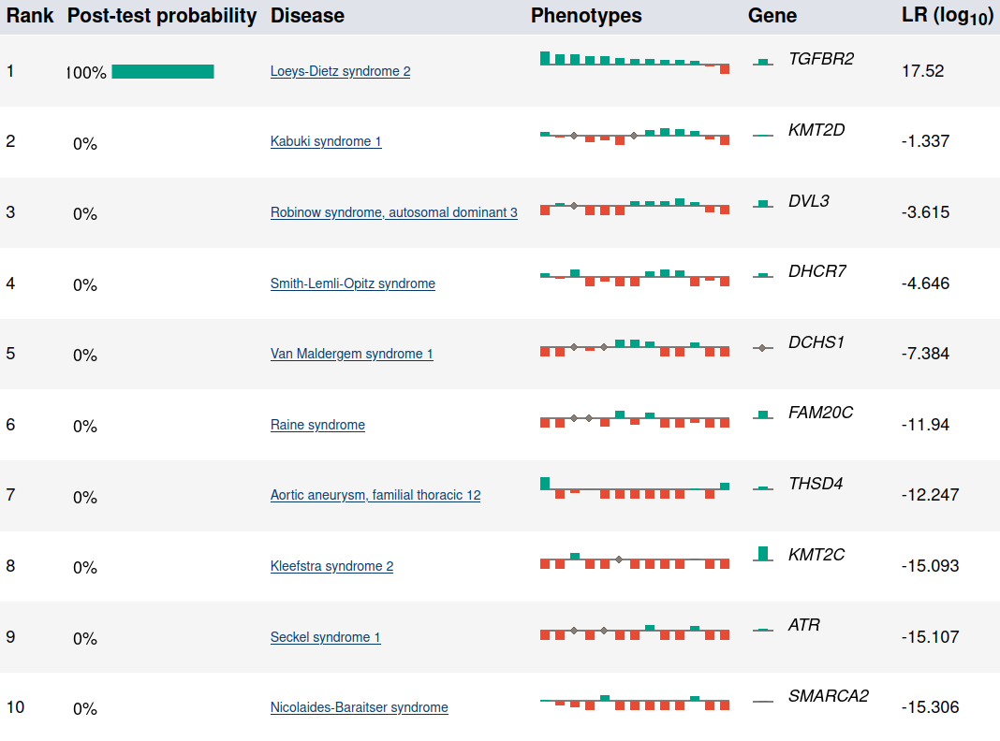

.. _rsttutorial:

Tutorial
========

This tutorial shows how to use LIRICAL to evaluate an exome.

Setup
~~~~~
Follow the instructions in :ref:`rstsetup` to get LIRICAL executable, download the database files
and the Exomiser database.
Note the location of the Exomiser variant database file.

The data
~~~~~~~~

We will run an exome analysis of a case reported in
`Cao et al., 2018 <https://www.ncbi.nlm.nih.gov/pubmed/?term=30101859>`_. The authors describe
a disease-associated mutation in the *TGFBR2* gene in *Patient 4*.

We have simulated an exome VCF file by adding the disease associated variant to
a VCF file derived from `project.NIST.hc.snps.indels.NIST7035.vcf` and we prepared a *phenopacket*
to represent patient's clinical data (see below). The files are available in the
`examples <https://github.com/TheJacksonLaboratory/LIRICAL/tree/master/lirical-cli/src/examples>`_
folder or in the distribution ZIP.

Creating a phenopacket
~~~~~~~~~~~~~~~~~~~~~~

Creating the phenopacket is an optional step and the example phenopacket can be used for the purpose of this tutorial.

Here is an excerpt of the text that described patient 4 in the above cited article:

.. parsed-literal::

    Patient 4 is a 9-year-old girl. She was clinically diagnosed with suspected
    Marfan syndrome according to the first impression. She was 144 cm tall and
    weighed 24 kg. Her father was 176 cm tall and weighed 53 kg. The phenotypes
    of this patient include strabismus, refractive error, pectus carinatum, scoliosis,
    arachnodactyly, and camptodactyly. The patient's main cardiovascular abnormalities
    were Sinus of Valsalva aneurysm, aortic root dilation, aortic regurgitation,
    atrial septal defect, patent foramen ovale, pulmonary artery dilatation, and
    tricuspid valve prolapse with regurgitation. Craniofacial abnormalities of the
    patient include bifid uvula, malar hypoplasia, and micrognathia.

Use the `PhenopacketGenerator <https://github.com/TheJacksonLaboratory/PhenopacketGenerator>`_
to create a Phenopacket.

To set up PhenopacketGenerator, you will first need to set the location of the hp.obo file
from the `Download page <https://hpo.jax.org/app/data/ontology>`_ of the HPO website.
Enter your Biocurator id by selecting "Set biocurator id" from the edit menu, and enter an arbitrary Phenopacket ID
and proband ID. Use the dropdown menus to enter "9 years" for Age and "Female" for sex.

From the edit menu, select "Set path to hp.obo file", then select the location of the hpo.obo on your computer.
After a moment, the ontology will load and "Enter HPO terms" will be clickable. Load HPO terms for this case by
clicking "Enter HPO term". Paste the clinical description above into the text-mining window of PhenopacketGenerator,
click "Analyze", select HPO terms, click "Add selected terms", then "Confirm and Close".

.. figure:: _static/hpo-textmining-lds.png
    :width: 75 %
    :align: center
    :alt: LDS2 text mining

Then, select the location of the VCF file that you saved in the previous step, and enter the Genome assembly (``hg19``).

.. figure:: _static/phenopacketgenerator.png
    :width: 75 %
    :align: center
    :alt: LDS2 text mining

You can now export the phenopacket. Use the filename ``LDS2.json``
(or choose another name and adjust the following command accordingly).

Running LIRICAL
~~~~~~~~~~~~~~~

Run LIRICAL as follows::

  lirical phenopacket \
  --assembly hg19 \
  --exomiser-hg19-dir /path/to/2406_hg19 \
  --phenopacket LDS2.v2.json \
  --vcf LDS2.vcf.gz \
  --prefix LDS2

.. note::

    We assume the LIRICAL alias was set as described in the :ref:`rstsetupalias` section.

.. note::

    We assume that ``/path/to/2406_hg19`` points to a folder with the ``2406`` Exomiser data release files.

Viewing the results
~~~~~~~~~~~~~~~~~~~

The above command will create a new file called `LDS2.html` (the ``-x | --prefix`` option controls the prefix of the output file).
Open this file in a web browser. The top of the page shows some information about the input files and a list of observed
and excluded HPO terms. The next section shows summarized representations of the top candidates.

    Summary view of the top candidates.

Each row in the summary shows the rank, post-test probability, and name/ID of the disease. The row includes a sparkline
representation of the phenotypic profiles of each candidate, with green bars indicating positive contributions and red bars
negative contributions to the diagnosis. The last bar represents the genotype likelihood ratio if LIRICAL was run with
a VCF file. Hovering over the individual bars will show the name of the HPO term or gene, and all sparklines show the terms
in the same order.

LIRICAL then presents a detailed analysis of each of the top candidates. The summary shows information about identified
variants and the phenotypic profile. Hovering over the graphic shows information about the likelihood ratio and the type of the
match.

.. figure:: _static/lirical-detailed-TGFBR2.png
    :width: 100 %
    :align: center
    :alt: LIRICAL sparkline

    Detailed view of the top candidate Loeys-Dietz syndrome type 2.

The remaining part of the HTML output page contains information about the other top candidates and a list of all
diseases analyzed. The bottom of the page includes explanations and documents the settings used for the analysis.
